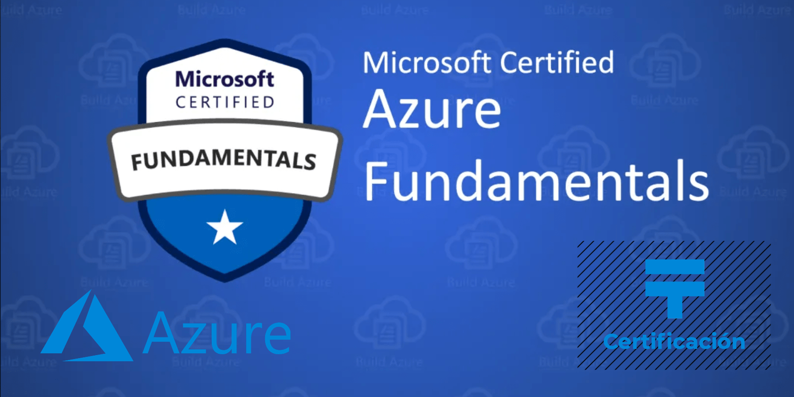

# [Core Cloud Services - Azure networking options](https://docs.microsoft.com/en-us/learn/modules/intro-to-azure-networking/)

## [Introduction](https://docs.microsoft.com/en-us/learn/modules/intro-to-azure-networking/1-introduction)

- How an Azure virtual network provides secure network communication among resources such as virtual machines and other networks
- What high availability and resiliency mean and how Azure Load Balancer can increase resiliency within a single geographic region
- What latency is and how Traffic Manager helps reduce network latency and provides resiliency across geographic locations

## [Deploy your site to Azure](https://docs.microsoft.com/en-us/learn/modules/intro-to-azure-networking/2-deploy-to-azure)

There are several strategies and patterns employed by software architects and designers to make these complex systems easier to design, build, manage, and maintain.
- **Benefits of Loosely Coupled Architectures**
- **Using an N-tier architecture**

- **What's an Azure region?**: A region is one or more Azure data centers within a specific geographic location.
- **What's a virtual network?**: A virtual network is a logically isolated network on Azure. Virtual networks can be segmented into one or more subnets. Subnets help you organize and secure your resources in discrete sections.
- **What's a network security group?**: A network security group, or NSG, allows or denies inbound network traffic to your Azure resources. Think of a network security group as a cloud-level firewall for your network.

### Check your knowledge

- **What is an Azure region?**
    - [x] One or more Azure data centers within a specific geographical location.
    - [ ] A way of breaking networks into smaller networks.
    - [ ] Firewall rules which define the flow of traffic in and out of Azure.
- Which of the following is true about virtual networks?
    - [x] You configure virtual networks through software.
    - [ ] A virtual network accepts network traffic on all ports. You configure the firewall through virtual machines.
    - [ ] Virtual networks are always reachable from the internet.

## [Scale with Azure Load Balancer](https://docs.microsoft.com/en-us/learn/modules/intro-to-azure-networking/3-scale-load-balancer)

>Availability refers to how long your service is up and running without interruption. High availability, or highly available, refers to a service that's up and running for a long period of time.

### What is resiliency?
Resiliency refers to a system's ability to stay operational during abnormal conditions.

These conditions include:
- Natural disasters
- System maintenance, both planned and unplanned, including software updates and security patches.
- Spikes in traffic to your site
- Threats made by malicious parties, such as distributed denial of service, or DDoS, attacks

### What is a load balancer?
A load balancer distributes traffic evenly among each system in a pool. A load balancer can help you achieve both high availability and resiliency.

### What is Azure Load Balancer?
Azure Load Balancer is a load balancer service that Microsoft provides that helps take care of the maintenance for you. Load Balancer supports inbound and outbound scenarios, provides low latency and high throughput, and scales up to millions of flows for all Transmission Control Protocol (TCP) and User Datagram Protocol (UDP) applications. You can use Load Balancer with incoming internet traffic, internal traffic across Azure services, port forwarding for specific traffic, or outbound connectivity for VMs in your virtual network.

### Azure Application Gateway
If all your traffic is HTTP, a potentially better option is to use Azure Application Gateway. Application Gateway is a load balancer designed for web applications. It uses Azure Load Balancer at the transport level (TCP) and applies sophisticated URL-based routing rules to support several advanced scenarios.

 

 Here are some of the benefits of using Azure Application Gateway over a simple load balancer:
- Cookie affinity
- SSL termination
- Web application firewall
- URL rule-based routes
- Rewrite HTTP headers

### What is a Content Delivery Network?
A content delivery network (CDN) is a distributed network of servers that can efficiently deliver web content to users. It is a way to get content to users in their local region to minimize latency. CDN can be hosted in Azure or any other location. You can cache content at strategically placed physical nodes across the world and provide better performance to end users.

### What about DNS?
DNS, or Domain Name System, is a way to map user-friendly names to their IP addresses.

### Check your knowledge
- **Which is true about Azure Load Balancer?**
     - [ ] You must use Azure Load Balancer if you want to distribute traffic among your virtual machines running in Azure.
     - [ ] Azure Load Balancer works with internet-facing traffic only.
     - [x] Azure Load Balancer distributes traffic among similar systems, making your services more highly available.

## [Reduce latency with Azure Traffic Manager](https://docs.microsoft.com/en-us/learn/modules/intro-to-azure-networking/4-reduce-latency-traffic-manager)

### What is network latency?
Latency refers to the time it takes for data to travel over the network. Latency is typically measured in milliseconds. Factors such as the type of connection you use and how your application is designed can affect latency. But perhaps the biggest factor is distance.

### Scale out to different regions
Recall that Azure provides data centers in regions across the globe. One way to reduce latency is to provide exact copies of your service in more than one region. The following illustration shows an example of global deployment.

### Use Traffic Manager to route users to the closest endpoint
Traffic Manager uses the DNS server that's closest to the user to direct user traffic to a globally distributed endpoint.

Traffic Manager doesn't see the traffic that's passed between the client and server. Rather, it directs the client web browser to a preferred endpoint. Traffic Manager can route traffic in a few different ways, such as to the endpoint with the lowest latency.

### Compare Load Balancer to Traffic Manager
Azure Load Balancer distributes traffic within the same region to make your services more highly available and resilient. Traffic Manager works at the DNS level, and directs the client to a preferred endpoint. This endpoint can be to the region that's closest to your user.

Load Balancer and Traffic Manager both help make your services more resilient, but in slightly different ways. When Load Balancer detects an unresponsive VM, it directs traffic to other VMs in the pool. Traffic Manager monitors the health of your endpoints. When Traffic Manager finds an unresponsive endpoint, it directs traffic to the next closest endpoint that is responsive.

### Check your knowledge
- **What is network latency?**
    - [ ] The amount of data that can fit on the connection.
    - [ ] The distance data must travel to reach its destination.
    - [x] The time it takes for data to travel over the network.
- **How does Azure Traffic Manager reduce latency?**
    - [ ] It chooses only the fastest networks between endpoints.
    - [x] It chooses the endpoint that's closest to the user's DNS server.
    - [ ] It caches content, similar to how content delivery networks work.

## [Summary](https://docs.microsoft.com/en-us/learn/modules/intro-to-azure-networking/5-summary)

You learned just a few ways Azure networking can help reduce latency and make your apps and services more highly available.

\
